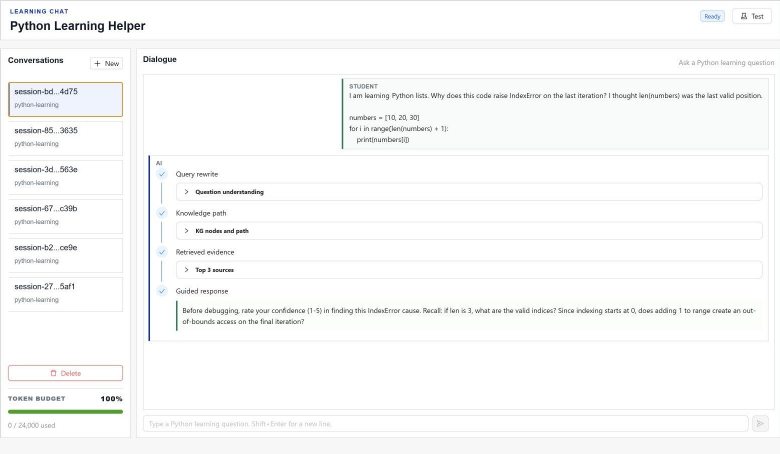
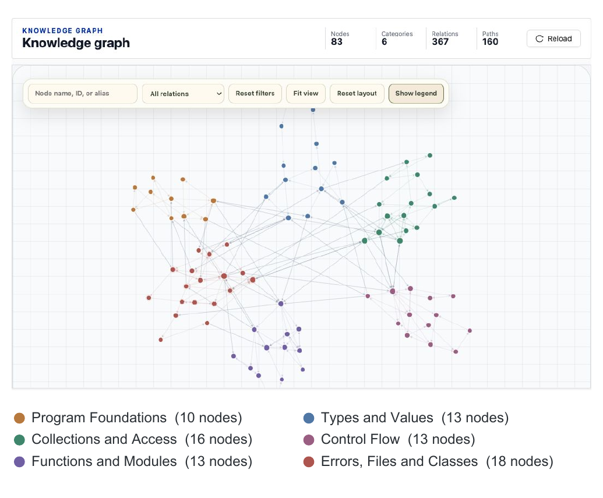
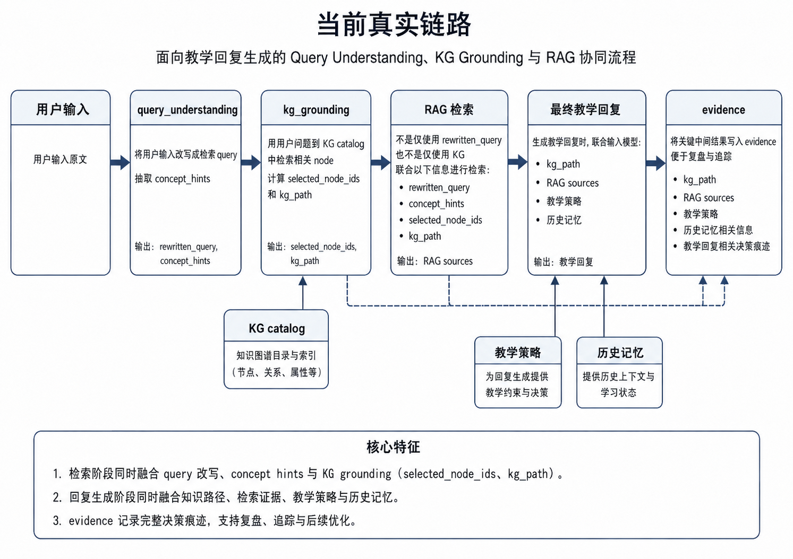

# Think Before You Copy

**Designing an AI Agent for Responsible Programming Learning**

This repository presents **EviAgent**, a research prototype that helps novice Python learners think before accepting AI-generated answers. Instead of acting as a direct solution generator, the system combines progressive pedagogical guidance, a curriculum knowledge graph, retrieval-augmented evidence, learner-state memory, and formative practice.

The project was completed in 2026 through the Summer Undergraduate Research Fellowship (SURF) at Xi'an Jiaotong-Liverpool University by **Xinling Du and Jinyu Cai under academic supervision**. Xinling Du led the formative study and pilot study; Jinyu Cai led the EviAgent development. The project combines a formative questionnaire study, an implemented full-stack prototype, and a small pilot study.

> Research artefact notice: the pilot evidence is descriptive and preliminary. It supports design refinement, not causal or population-level claims.



## Why this project

General-purpose coding assistants can make programming faster, but they can also encourage answer copying, cognitive offloading, and uncritical trust. EviAgent explores a different interaction contract: preserve productive learner effort, make supporting evidence inspectable, and reveal how concepts connect.

The formative study collected 72 questionnaires and analysed 40 complete cases. Participants reported high perceived usefulness alongside concerns about dependency, skill development, and reliability. These findings were translated into five design goals:

1. preserve learner autonomy through attempt-first, progressively disclosed help;
2. ground explanations in inspectable sources and knowledge relations;
3. turn explanations into debugging, practice, and teach-back activities;
4. build longitudinal learner modelling and reflection support;
5. improve context awareness and development-tool integration.

The current prototype implements the first three goals. Goals 4 and 5 remain future work.

## System highlights

- **Guided tutoring:** classifies learning intent and moves from diagnosis to hints before revealing direct answers.
- **Evidence-grounded RAG:** retrieves and reranks material from a curated Python learning corpus.
- **Curriculum knowledge graph:** connects 83 concepts across six clusters, 367 relations, and 160 learning paths.
- **Learning trace and memory:** records compact evidence about attempts, misconceptions, confidence, and progress.
- **Interactive practice:** generates topic-aware checks spanning terminology, prediction, debugging, and transfer.
- **Inspectable assistance:** surfaces sources, graph paths, learning evidence, and token-use feedback.



## Architecture

The prototype is a three-part system:

- a React/TypeScript learner and researcher interface;
- a Go API gateway with SQLite-backed study and learning records;
- a Python AI core for pedagogical policy, RAG, knowledge-graph grounding, and structured model output.

The repository also includes a Docker deployment, evaluation harnesses, automated checks, curriculum graph definitions, and the processed corpus/index required by the demo.



More detail is available in [the architecture document](docs/architecture.md) and the [paper-to-implementation matrix](docs/research/paper_to_implementation_matrix.md).

## Repository map

The public portfolio mirrors the study flow used in the OSF archive. The system
implementation stays in its runnable root paths and is indexed from stage 02.

```text
study/
  01-formative-study/         Instrument, analysis code, and aggregate results
  02-eviagent-system/         Map to the runnable implementation
  03-pilot-study/             Protocol, instrument, code, and aggregate results
frontend/                    React/TypeScript interface and UI tests
services/ai-core-python/     Pedagogy, RAG, KG, memory, and model orchestration
services/api-gateway-go/     API, persistence, research endpoints, and migrations
kg/                          Curated Python concept graph and learning paths
data/processed/              Cleaned public learning corpus
data/indexes/                Retrieval indexes used by the prototype
harness/                     Reproducible evaluation cases
scripts/                     Corpus, KG, evaluation, and integrity tooling
docs/                        Design, research rationale, and runbooks
showcase/                    Poster and selected interface figures
```

## Run locally

Requirements: Docker Desktop and a DashScope API key.

```bash
cp .env.example .env
# Add your key to .env, then:
docker compose up -d --build
```

Open <http://localhost:18081>. The health endpoint is <http://localhost:18081/api/health>.

The API key is read only from the local `.env` or deployment secret store. It must never be committed or placed in browser-side code.

## Research artefacts

The [`study/`](study/) folder contains a deliberately compact public record:

- [`01-formative-study/`](study/01-formative-study/) contains the questionnaire instrument, aggregate quantitative and qualitative findings, and analysis code;
- [`02-eviagent-system/`](study/02-eviagent-system/) maps the OSF system stage to the runnable source tree;
- [`03-pilot-study/`](study/03-pilot-study/) contains the pilot protocol and instrument, aggregate descriptive results, and analysis code;
- participant-level exports and open-text response workbooks remain outside the public repository.

The corresponding research archive is on [OSF](https://osf.io/fuvkd/overview). Access is governed separately by the OSF project's visibility settings.

Headline pilot observations from six undergraduates were encouraging but preliminary: 5/6 perceived guided thinking, 6/6 perceived reliability support, and 6/6 reported support for programming understanding. Across two tasks, 11/12 agent ratings and 12/12 knowledge-graph ratings were positive.

## Reproducibility and scope

- Source code, tests, processed retrieval artefacts, study instruments, and aggregate results are included.
- Large raw source corpora, local runtime databases, generated caches, participant-level exports, and third-party paper PDFs are intentionally excluded.
- The public demo uses ephemeral SQLite storage and is not intended for production or sensitive research data collection.
- See [`docs/source-attribution.md`](docs/source-attribution.md) for corpus provenance and attribution.

## Team contributions

- **Xinling Du:** formative-study design and materials, data preparation and analysis, pilot-study design and analysis, and research reporting.
- **Jinyu Cai:** primary development of the EviAgent system.
- **Both students:** research framing, iterative design discussions, and project communication under academic supervision.

## SURF poster

The final project poster is available as [`PDF`](showcase/SURF-2026-poster.pdf) and [`JPG`](showcase/SURF-2026-poster.jpg).

