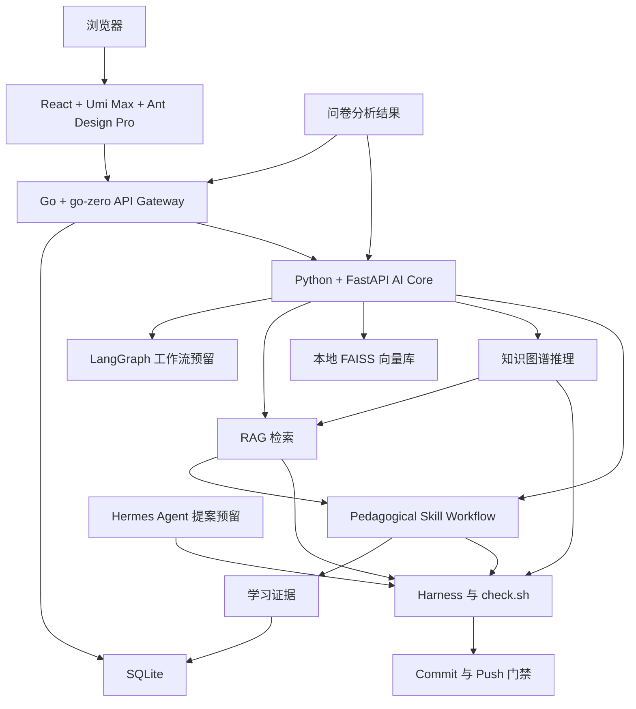
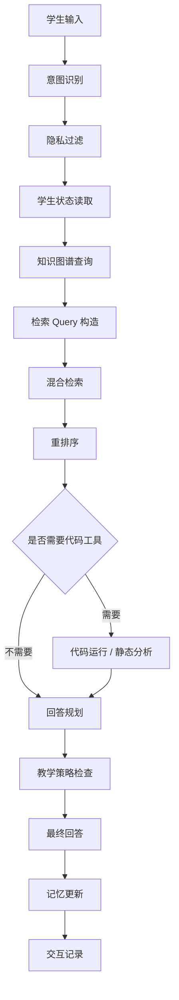
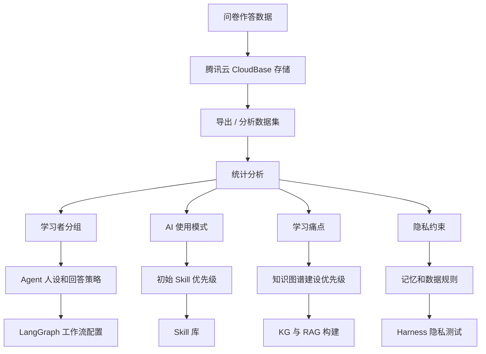

# AI Agent 辅助编程学习系统总体架构

## 1. 项目定位

本项目是一个面向 Python 编程学习的 AI Agent 辅助学习系统。系统目标是让学生在学习 Python 的过程中获得更准确、更有结构、更适合自身水平的解释、提示、练习和反馈。

系统围绕一条完整闭环展开：

1. 通过问卷收集学生的编程学习背景、AI 工具使用经验、学习需求和风险感知；
2. 对问卷结果进行统计分析，形成学习者画像、需求分组和系统功能优先级；
3. 构建 Python 学习知识图谱和课程知识库；
4. 通过知识图谱引导 RAG 检索，生成有依据的学习反馈；
5. 使用 LangGraph 编排多步骤学习 Agent 工作流；
6. 使用短期、中期、长期记忆逐步形成对单一学生的理解；
7. 使用 Hermes Agent 作为后台自改进层，提出知识、技能和评测用例更新；
8. 使用 Harness 和 `check.sh` 作为提交门禁，保证知识、检索、回答、隐私和 Git 推送都经过验证。

当前问卷不是独立的小项目，而是整个系统的第一层数据入口。问卷结果决定系统先支持哪些学习场景、优先构建哪些 Python 知识点、需要控制哪些隐私风险，以及学习 Agent 的回答风格如何设计。

## 2. 当前问卷模块

当前仓库已经包含一个面向 AI 辅助编程学习的中英文双语问卷。该问卷承担系统的第一阶段数据收集任务。

当前问卷已经具备以下行为：

- 问卷通过 HTTPS 链接和二维码访问；
- 微信扫码后会在微信内置浏览器中打开；
- 不使用微信登录；
- 不收集 OpenID、微信号、微信昵称或微信头像；
- 每一页必须填写完整后才能进入下一页；
- 进入下一页后不可回退；
- 对没有编程学习经历或没有 AI 工具使用经历的用户支持提前结束；
- 用户作答提交到现有腾讯云 CloudBase 后端；
- 前端会检查 CloudBase 的返回结果，只有后端确认成功后才显示提交成功。

当前提交接口为：

```text
https://<your-cloudbase-domain>/submitResponse
```

问卷数据在完整系统中承担三类作用：

1. **研究分析**：分析学生背景、AI 工具使用经验、学习体验、风险感知和功能需求。
2. **系统设计输入**：决定学习 Agent 的第一批功能、知识范围和交互策略。
3. **个性化策略输入**：在正式引入长期记忆之前，先通过群体分析定义学习者类型和解释策略。

## 3. 问卷结果如何嵌入完整项目

问卷分析是研究问题和工程系统之间的连接层。

问卷分析产出以下结构化结果：

- 学生专业、年级、编程基础分布；
- 学生是否学过编程课程；
- 学生接触过哪些编程语言；
- 学生使用 AI 工具辅助编程的频率；
- 学生主要使用哪些 AI 工具；
- 学生认为 AI 对编程学习的帮助点；
- 学生对 AI 辅助编程的担忧；
- 学生对 AI 正确性、依赖性、隐私性的态度；
- 学生更希望获得哪种学习支持；
- 不同背景学生在 AI 使用行为上的差异。

这些结果会被转化为工程设计输入：

| 问卷分析结果 | 系统设计影响 |
| --- | --- |
| 初学者比例高 | Agent 默认采用分步解释和提示式教学 |
| 学生常用 AI 调试代码 | `debug_error` 成为第一批核心 skill |
| 学生担心 AI 胡说 | RAG 引用和 Harness 评测成为强制环节 |
| 学生担心过度依赖 AI | 做题场景采用分层提示，不直接给最终答案 |
| 学生 Python 基础薄弱 | 知识图谱优先覆盖变量、条件、循环、列表、函数和错误 |
| 学生喜欢例子 | 回答必须包含短示例、对比例子或可运行代码 |
| 学生关注隐私 | 记忆系统采用最小化存储和明确授权机制 |

问卷结果直接控制后续路线图。它决定第一批知识图谱范围、第一批 RAG 文档、第一批技能、第一批评测样例和第一批个性化规则。

## 4. 总体系统架构

工程实现采用三层服务架构：

1. **React + Umi Max + Ant Design Pro 前端**：负责 Agent 后台、学习会话、证据面板、skill 清单、KG/RAG 可视化。
2. **Go + go-zero 主服务**：负责单端口入口、前端静态资源、业务 API、SQLite 数据、统一日志和对 Python AI Core 的服务调用。
3. **Python + FastAPI AI Core**：负责 LangGraph 预留、RAG、FAISS、知识图谱推理、embedding、pedagogical skill workflow 和 Hermes 提案预留。

这套设计把工程交付和 AI 能力解耦。Go 不直接实现 LangGraph/RAG/FAISS，Python 不承担产品入口和前端交付。Go 负责系统外壳和稳定服务，Python 负责 AI 内核和研究能力。



系统分为八层：

1. 问卷与分析层；
2. React/Umi/Ant Design Pro 前端可视化层；
3. Go/go-zero 主服务层；
4. Python/FastAPI AI Core 层；
5. 知识图谱与 RAG 层；
6. 记忆与学习者建模层；
7. Hermes Agent 自改进提案层；
8. Harness 与 `check.sh` 门禁层。

每一层职责固定。问卷定义真实学习需求，前端负责可视化表达，Go 主服务负责产品化交付，Python AI Core 负责智能能力，知识图谱定义 Python 概念结构，RAG 提供证据，记忆系统负责个性化，Hermes 提出改进，Harness 验证所有变更。

## 5. 知识图谱层

知识图谱是整个编程学习系统的结构骨架。它存储 Python 概念、前置关系、常见误区、错误类型、练习题、课程资源和学生掌握状态。

知识图谱解决普通 RAG 无法稳定解决的问题：

- 明确一个概念依赖哪些前置知识；
- 识别学生混淆了哪些概念；
- 将题目映射到具体知识点；
- 将错误类型映射到可能的知识缺口；
- 支持学习路径规划；
- 支持对单一学生的掌握度建模。

### 5.1 节点类型

| 节点类型 | 含义 |
| --- | --- |
| `Concept` | Python 知识点，例如变量、循环、列表、函数、类 |
| `Syntax` | 具体语法规则，例如缩进、冒号、赋值 |
| `ErrorType` | 常见错误类型，例如 `TypeError`、`IndexError`、`NameError` |
| `Misconception` | 常见误区，例如混淆 `=` 和 `==` |
| `Exercise` | 课程练习题或系统生成练习 |
| `Resource` | 教材章节、课件页、代码示例、解释材料 |
| `Skill` | 可复用学习能力，例如“诊断列表索引错误” |
| `StudentState` | 某个学生对某个概念或技能的掌握状态 |

### 5.2 边类型

| 边类型 | 含义 |
| --- | --- |
| `requires` | 概念 A 依赖概念 B |
| `related_to` | 两个概念相关 |
| `often_confused_with` | 两个概念经常被混淆 |
| `causes_error` | 某个误区或薄弱概念容易导致某类错误 |
| `tested_by` | 某个概念被某道题考察 |
| `explained_by` | 某个概念由某份材料解释 |
| `practiced_by` | 某个技能由某道题练习 |
| `weak_for` | 某个学生在该概念上薄弱 |
| `mastered_by` | 某个学生已经掌握该概念 |

### 5.3 第一阶段知识图谱范围

第一阶段知识图谱覆盖 Python 基础：

- 变量与赋值；
- 基本数据类型；
- 字符串；
- 列表；
- 字典；
- 条件判断；
- 循环；
- 函数；
- 参数与返回值；
- 模块；
- 文件读写；
- 常见 Python 错误；
- 调试流程；
- 简单程序拆解。

这个范围对应第一阶段目标学生：正在学习或刚开始使用 AI 辅助学习 Python 的学生。该范围足够支撑检索、提示、纠错、练习推荐和学习路径规划。

## 6. RAG 层

RAG 负责提供有依据的解释。Agent 不只依赖模型自身记忆回答问题，而是在回答前检索课程资料、题库、代码示例和教师认可的解释材料。

RAG 层包括以下组件：

1. 文档清洗；
2. 分块；
3. 元数据抽取；
4. 向量化；
5. 向量库；
6. 混合检索；
7. 知识图谱过滤；
8. 重排序；
9. 带证据的回答生成。

### 6.1 分块算法

分块算法采用编程学习友好的结构化分块。

分块时保留以下内容：

- 完整代码块；
- 概念解释和示例配对；
- 题目描述和学习目标；
- 错误信息和修正方式；
- 章节标题和层级；
- 章节、概念、难度、来源、语言等元数据。

系统不把固定长度切分作为主要分块方式。固定 token 窗口容易把代码和解释切散，导致检索结果可读性和准确性下降。主分块策略采用语义结构和课程结构结合的方式。

标准 chunk 结构：

```json
{
  "chunk_id": "python.list.append.example.001",
  "source": "course_slide_week_03",
  "title": "List append",
  "concepts": ["list", "append", "mutation"],
  "difficulty": "beginner",
  "text": "解释文本和代码示例",
  "code_blocks": ["numbers.append(3)"],
  "graph_nodes": ["Concept:list", "Concept:append"]
}
```

### 6.2 向量化方法

向量化将文本 chunk 转换为语义向量，用于相似度检索。

向量化模型必须支持中英文混合内容和编程文本。向量化管线保存以下字段：

- 原始 chunk 文本；
- 规范化文本；
- 向量；
- 元数据；
- 关联的知识图谱节点 ID。

### 6.3 向量库方案

向量库负责存储 embedding 并提供相似度搜索。

项目的向量库选型按部署环境确定：

- 小规模研究原型采用 PostgreSQL + `pgvector`；
- 腾讯云部署采用腾讯云 VectorDB；
- 数据量和并发量显著上升后采用 Milvus。

第一阶段语料规模是课程资料、题库、常见错误和解释材料，不是互联网级语料。系统从轻量、可控、可测试的向量库开始。

### 6.4 检索方法

检索采用混合检索：

1. 使用知识图谱识别相关概念和前置概念；
2. 对错误信息、函数名、关键语法采用关键词检索；
3. 对自然语言问题采用向量检索；
4. 根据难度、章节、课程阶段和概念范围进行过滤；
5. 对候选结果进行重排序；
6. 只把最强证据传给 Agent。

这套流程是 **KG-guided RAG**。

知识图谱定义检索目标，RAG 查找文本证据，重排序选择真正支持当前问题的材料。

## 7. 重排序层

重排序用于提升检索精度。

系统先召回较大的候选集合，例如 top 20 或 top 50；然后由 reranker 选出最终证据集合，例如 top 5。

编程学习场景必须使用重排序，因为大量词语存在歧义：

- `list` 既可以表示 Python 列表，也可以表示普通清单；
- `return` 既可以表示函数返回，也可以是普通动词；
- `class` 既可以表示类，也可以表示班级；
- `error` 可以指语法错误、运行时错误、逻辑错误或概念错误。

重排序输入包括学生问题、图谱上下文、难度级别和候选 chunk。输出是按教学相关性排序后的证据列表。

## 8. LangGraph Agent 工作流

LangGraph 负责编排多步骤学习流程。它不承担知识存储职责，而是负责把意图识别、知识图谱、RAG、代码工具、记忆系统和回答生成组织成稳定流程。

Agent 工作流包含以下确定性节点：

1. 输入规范化；
2. 意图识别；
3. 隐私检查；
4. 学生状态读取；
5. 知识图谱查询；
6. 检索 query 构造；
7. 混合检索；
8. 重排序；
9. 必要时代码运行或静态代码检查；
10. 教学反馈生成；
11. 教学策略与安全检查；
12. 记忆更新；
13. 交互记录。



LangGraph 同时支持可恢复工作流。每次交互都以状态转移形式保存，便于调试、评测、复现和人工审查。

## 9. Hermes Agent 层

Hermes Agent 用作后台自改进层。

Hermes 不直接面对学生，不直接修改线上知识，不直接把新 skill 推入生产系统。Hermes 的职责是提出改进提案，所有提案必须经过 Harness 验证后才能进入 Git。

Hermes 承担以下任务：

- 分析新增课程资料；
- 提议新的知识图谱节点和边；
- 发现缺失的前置知识关系；
- 提议新的可复用 skill；
- 总结学生反复出现的学习困难；
- 建议新增或修正 RAG chunk；
- 生成新的 harness 评测用例；
- 发现过时、薄弱或不准确的解释材料。

Hermes 的输出是提案，不是生产变更。Harness 验证提案，Git 记录通过验证的变更。

这套设计保留了自改进能力，同时保证正确性、教学边界、隐私要求和可复现性。

## 10. Skills 系统

Skills 是可复用的学习和 Agent 行为模块。每个 skill 对应一种稳定的教学任务。

第一批 skills：

| Skill | 作用 |
| --- | --- |
| `explain_concept` | 按学生当前水平解释 Python 概念 |
| `debug_error` | 诊断错误信息并连接到对应概念 |
| `hint_for_exercise` | 对练习题提供分层提示，不直接给最终答案 |
| `compare_concepts` | 解释容易混淆的概念差异 |
| `generate_practice` | 根据薄弱概念生成练习 |
| `review_mistake` | 把错误转化为学习总结 |
| `summarize_progress` | 总结近期学习进展 |
| `plan_next_step` | 推荐下一个概念或练习 |

每个 skill 包含：

- 触发条件；
- 输入字段；
- 知识图谱查询规则；
- RAG 检索要求；
- 输出格式；
- 教学约束；
- Harness 测试用例。

示例 skill 规格：

```yaml
id: debug_index_error
name: Debug IndexError
trigger:
  intent: code_debugging
  error_type: IndexError
requires_graph_nodes:
  - Concept:list
  - Concept:index
  - ErrorType:IndexError
retrieval:
  top_k_before_rerank: 20
  top_k_after_rerank: 5
teaching_policy:
  - explain cause before fix
  - show minimal corrected example
  - ask learner to identify index range
tests:
  - harness/cases/debug_index_error_basic.json
```

Hermes 可以在发现高频学习模式后提出新 skill。Harness 验证 skill 的触发条件、检索质量、回答质量和隐私字段。验证通过后，skill 才能进入仓库。

## 11. 短期、中期、长期记忆

记忆系统负责让 Agent 对单一学生越用越懂。记忆的目的只有一个：提升学习支持质量。记忆系统不收集无关个人身份。

### 11.1 短期记忆

短期记忆覆盖当前对话或当前学习会话。

短期记忆保存：

- 当前问题；
- 当前代码片段；
- 当前练习题；
- 最近几轮解释；
- 尚未解决的困惑；
- 当前知识图谱上下文；
- 当前检索证据。

短期记忆保证多轮对话连续。

### 11.2 中期记忆

中期记忆覆盖最近若干次学习行为。

中期记忆保存：

- 最近练习过的概念；
- 最近出现的错误；
- 重复出现的误区；
- 最近练习结果；
- 从行为中推断出的解释偏好；
- 近期学习进展摘要。

中期记忆用于保持学习连续性，避免系统每次都把学生当成新用户。

### 11.3 长期记忆

长期记忆保存稳定学习特征和掌握度估计。

长期记忆保存：

- 概念掌握度；
- 长期薄弱点；
- 长期优势点；
- 有效解释方式；
- 学习节奏偏好；
- 语言偏好；
- 长期学习目标。

长期记忆必须配合明确的隐私设计。长期记忆不依赖微信身份、OpenID 或 IP 地址。身份机制只能来自明确同意的账户体系，或本地匿名学习者 ID。

### 11.4 记忆数据模型

```json
{
  "learner_id": "anonymous_or_consented_id",
  "concept_mastery": {
    "Concept:list": 0.62,
    "Concept:loop": 0.48,
    "Concept:function": 0.31
  },
  "recent_misconceptions": [
    "Misconception:list_index_out_of_range",
    "Misconception:assignment_vs_equality"
  ],
  "preferred_response_style": {
    "language": "zh-CN",
    "detail_level": "step_by_step",
    "example_frequency": "high"
  },
  "updated_at": "ISO-8601 timestamp"
}
```

## 12. Harness 与 check.sh

Harness 是项目质量门禁。`check.sh` 是门禁的统一执行入口。

知识图谱更新、RAG 更新、skill 更新、Agent 工作流更新和隐私字段更新都必须通过 Harness。

Harness 检查六类内容。

### 12.1 知识图谱一致性

检查内容：

- 没有重复概念 ID；
- 没有断裂边；
- 没有非法节点引用；
- 没有不支持的边类型；
- 前置关系环被检测并明确标记；
- 每道练习题至少关联一个知识点；
- 每个核心概念至少有解释资源。

### 12.2 RAG 语料质量

检查内容：

- 每个 chunk 都有来源元数据；
- chunk 尽量关联知识图谱节点；
- 代码块没有被错误切开；
- 核心概念有对应解释材料；
- 检索评测问题能命中预期 chunk。

### 12.3 重排序质量

检查内容：

- 相关 chunk 排在无关 chunk 前面；
- 歧义词能被正确处理；
- 初学者问题不会优先返回高级材料；
- 错误信息类问题能返回对应错误解释。

### 12.4 Agent 行为质量

检查内容：

- 调试回答先解释原因，再给修复方法；
- 做题场景先给提示，再逐步展开；
- 需要代码时生成可运行代码；
- 回答难度匹配学生水平；
- 回答确实使用检索证据；
- 回答不越过教学边界。

### 12.5 隐私与数据治理

检查内容：

- 不采集微信 OpenID；
- 不用 IP 作为身份；
- 不加入隐藏个人标识；
- 记忆字段受白名单控制；
- 日志不保存无关个人信息；
- 问卷数据和学习记忆分离。

### 12.6 Git 门禁

检查内容：

- 单元测试通过；
- 知识图谱验证通过；
- RAG 检索评测通过；
- reranker 评测通过；
- skill 测试通过；
- 隐私字段检查通过；
- 推送前分支状态清晰。

标准 `check.sh` 结构：

```bash
#!/usr/bin/env bash
set -euo pipefail

npm test
python scripts/validate_kg.py
python scripts/validate_chunks.py
python scripts/eval_retrieval.py
python scripts/eval_reranker.py
python scripts/eval_agent_cases.py
python scripts/check_privacy_fields.py
git status --short
```

Harness 让项目变成可控研究系统。新增概念、新增 skill、新增图谱边、新增语料和新增流程都必须通过自动检查。

## 13. 问卷到学习 Agent 的数据流



问卷分析直接生成工程配置：

- 学习者分组成为初始 learner profile；
- AI 工具使用情况决定 skill 优先级；
- 学习困难决定知识图谱构建顺序；
- 隐私担忧决定记忆系统限制；
- 有用性量表成为系统效果评价维度；
- 开放题回答成为新误区、新场景和新测试用例来源。

## 14. 研究与评估设计

项目评估分为问卷评估和系统评估两层。

### 14.1 问卷评估

问卷测量：

- 学生背景；
- 编程学习经历；
- AI 工具使用经历；
- 感知有用性；
- 感知易用性；
- 对正确性的信任；
- 对过度依赖的担忧；
- 学习动机；
- 偏好的支持方式；
- AI 辅助编程学习的阻碍因素。

问卷分析识别：

- 哪些学生最需要学习 Agent；
- 哪些功能最有价值；
- 哪些风险必须被控制；
- 哪些解释策略更适合目标群体；
- 哪些隐私边界不能突破。

### 14.2 系统评估

学习 Agent 评估：

- 检索准确率；
- 图谱一致性；
- 回答正确性；
- 教学有效性；
- 提示质量；
- 代码调试成功率；
- 学生进步情况；
- 重复错误减少情况；
- 用户满意度；
- 隐私合规性。

Harness 负责自动评测，教师审查和用户研究负责人工评测。

## 15. 实施路线

### Phase 1：问卷与证据层

交付物：

- 稳定公开问卷 URL；
- 二维码海报；
- CloudBase 提交链路；
- 作答数据导出；
- 问卷分析报告；
- 学习者分组总结；
- 初始隐私约束。

完成标准：

- 作答能成功存入后端；
- 不收集微信身份；
- 问卷分析能产出系统需求；
- 分析结果支撑第一阶段 Agent 范围。

### Phase 2：知识图谱 MVP

交付物：

- Python 基础概念分类；
- 概念前置关系；
- 常见误区节点；
- 错误类型节点；
- 题目到概念映射；
- 资源到概念映射；
- 图谱验证脚本。

完成标准：

- 每个初始 Python 概念都有资源；
- 每道练习题关联知识点；
- 图谱验证进入 `check.sh`；
- 图谱支持前置知识查询和误区查询。

### Phase 3：RAG MVP

交付物：

- 课程资料导入；
- 结构化分块；
- embedding 管线；
- 向量数据库；
- 混合检索；
- 重排序；
- 检索评测集。

完成标准：

- 测试问题能检索到预期课程 chunk；
- 初学者问题能返回初学者材料；
- 代码示例在 chunk 中保持完整；
- 检索评测进入 `check.sh`。

### Phase 4：KG-guided RAG Agent

交付物：

- LangGraph 工作流；
- 意图识别节点；
- 知识图谱查询节点；
- 检索节点；
- 重排序节点；
- 回答生成节点；
- 代码调试工具；
- 教学策略检查节点。

完成标准：

- 概念问题使用图谱上下文；
- 调试问题能把错误连接到概念；
- 做题问题使用分层提示；
- 回答使用检索证据；
- Agent 测试用例通过。

### Phase 5：记忆与个性化

交付物：

- 短期记忆；
- 中期学习摘要；
- 长期掌握度模型；
- 隐私字段白名单；
- 记忆更新规则；
- 持久身份启用时的同意文本。

完成标准：

- 系统能根据近期交互调整解释；
- 记忆更新可检查；
- 隐私测试阻止违规字段；
- 系统不存在隐藏身份采集。

### Phase 6：Hermes 辅助自改进

交付物：

- Hermes 提案流程；
- skill 提案格式；
- 知识图谱更新提案格式；
- RAG 语料更新提案格式；
- Harness 审查流程。

完成标准：

- Hermes 只产生提案，不直接修改生产状态；
- 提案接受 Harness 验证；
- 通过验证的提案进入 Git；
- 未通过验证的提案输出明确失败原因。

## 16. 目标仓库结构

目标仓库结构如下：

```text
questionnaire/
  app.js
  index.html
  styles.css
  static-server.js
  docs/
    ai-programming-learning-system-architecture.md
    questionnaire-analysis-plan.md
    privacy-policy-for-learning-memory.md
  kg/
    concepts.yaml
    edges.yaml
    misconceptions.yaml
    exercises.yaml
  rag/
    sources/
    chunks/
    chunk_schema.json
    retrieval_eval_cases.json
  skills/
    explain_concept.yaml
    debug_error.yaml
    hint_for_exercise.yaml
  harness/
    cases/
    expected_retrieval/
    expected_agent_outputs/
  scripts/
    validate_kg.py
    validate_chunks.py
    eval_retrieval.py
    eval_reranker.py
    eval_agent_cases.py
    check_privacy_fields.py
  check.sh
```

这个结构保证知识、检索、skills、测试、隐私检查和问卷材料全部留在 Git 中，便于审查、复现和协作。

## 17. 隐私与治理规则

系统遵守数据最小化原则。

规则如下：

- 问卷不收集微信身份；
- 问卷不要求登录；
- 学习记忆只保存学习适配所需字段；
- 持久学习者身份必须经过明确同意；
- IP 地址不作为学习者身份；
- OpenID 不进入当前系统；
- 学生代码片段视为学习数据，不对外共享；
- 日志最小化；
- Harness 检查日志和记忆字段；
- 研究导出数据在分析前匿名化。

隐私通过两种方式保证：

1. 架构上分离问卷数据、学习记忆和身份体系；
2. 工程上通过 Harness 阻止违规字段进入代码和数据结构。

## 18. 系统最终定义

本项目是一个由问卷数据驱动、知识图谱引导、RAG 提供证据、LangGraph 编排流程、记忆系统实现个性化、Hermes 辅助自改进、Harness 保证质量门禁的 AI 编程学习系统。

问卷负责提供真实学生数据和研究证据。知识图谱负责组织 Python 概念、前置关系、错误、误区、题目和资源。RAG 负责检索可引用的课程材料。重排序负责筛选最相关证据。LangGraph 负责组织学习流程。记忆系统负责让 Agent 对单一学生越用越懂。Hermes 负责提出新知识和新 skill。Harness 与 `check.sh` 负责在提交和推送前验证所有变更。

这套架构同时服务研究和工程：

- 研究侧回答学生如何使用 AI 学习编程、他们需要什么、担心什么；
- 工程侧把这些发现转化成可运行的学习 Agent；
- 评估侧证明知识、检索、个性化和隐私在系统扩展过程中保持可靠。
